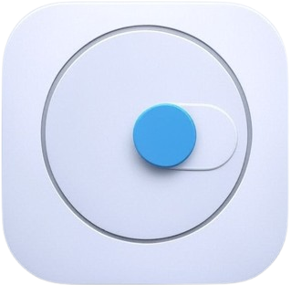
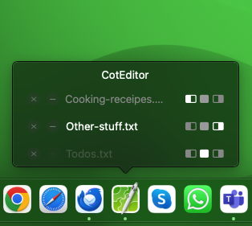

# DockAppToggler

<p align="center">
  
</p>

<p align="center">
  A professional macOS utility that enhances Dock functionality by allowing you to toggle app visibility and manage windows with a single click.
</p>

<p align="center">
  
</p>

Transform your macOS Dock into a powerful window management hub while maintaining the clean macOS experience you love.

## Features

- Smart Window Preview & Selection
  - Instantly preview all windows when hovering over Dock icons
  - Direct window selection replaces macOS's cycle-through approach
  - Intelligent window state memory and restoration

- Advanced Window Controls
  - One-click window snapping to left/right
  - Maximize with multi-display support
  - Center positioning
  - Quick-hide active windows

- Multi-Display Support
  - Seamlessly move windows between displays with visual indicators
  - Smart window management across screens
  - Instant position memory and restoration

- Modern UI Integration
  - Beautiful bubble-style previews with smooth animations
  - Automatic light/dark mode adaptation
  - Intuitive status indicators for window states

## System Requirements

- macOS 13.0 or later
- Accessibility permissions (required for window management)

## Installation

### Direct Download
1. Download the latest DMG from the [GitHub releases page](https://github.com/LimTec-de/DockAppToggler/releases)
2. Move DockAppToggler.app to your Applications folder
3. Launch the app
4. Grant accessibility permissions when prompted

### Homebrew
```bash
not available yet
```

## Building from Source

### Prerequisites

- Xcode 14.0 or later
- Swift 5.9 or later
- Apple Developer Account (for signing and notarization)

### Build Steps

1. Clone the repository:
   ```bash
   git clone https://github.com/LimTec-de/DockAppToggler.git
   cd DockAppToggler
   ```

2. Build the app:
   ```bash
   swift build
   ```

3. Run the app:
   ```bash
   swift run
   ```

### Development Setup

The project uses Swift Package Manager for dependency management. To open in Xcode:

```bash
open Package.swift
```

## Contributing

1. Fork the repository
2. Create your feature branch (`git checkout -b feature/amazing-feature`)
3. Commit your changes (`git commit -m 'feat: add amazing feature'`)
4. Push to the branch (`git push origin feature/amazing-feature`)
5. Open a Pull Request

## License

This project is open source. See the LICENSE file for details.

## Contact

LimTec GmbH
- Website: [https://www.limtec.de](https://www.limtec.de)
- Location: Halderstr. 16, D-86150 Augsburg, Germany